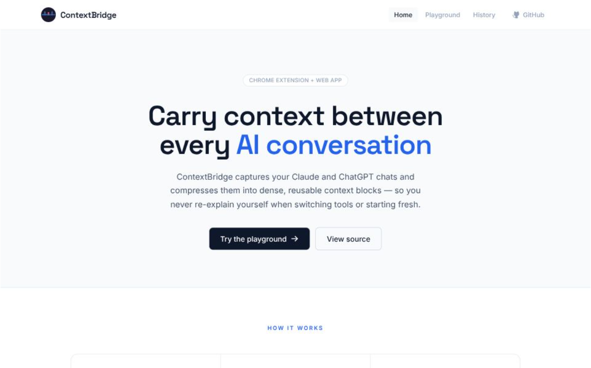

# ContextBridge 🌉

**Live App:** [https://context-bridge-smoky.vercel.app/](https://context-bridge-smoky.vercel.app/)



ContextBridge is a Chrome Extension + Next.js app that captures AI chat conversations and compresses them into dense, reusable context blocks — so you can carry context from one AI session (or tool) into another without manual copy-pasting.

## ✨ Features

- **One-click capture** of conversations on **claude.ai** and **chatgpt.com**, with message roles preserved.
- **Smart truncation**: keeps as many recent turns as fit in a ~110k character budget (whole turns only), and shows you exactly how many turns were included (e.g. "42 of 87 turns").
- **High-fidelity AI compression**: a Gemini model (default `gemini-2.0-flash`, configurable via `GEMINI_MODEL`) distills the conversation into a structured, domain-agnostic snippet — goal, key facts & entities, current state, decisions, open items & next steps, context & constraints. The prompt is engineered to preserve hard facts verbatim (amounts, dates, IDs, names, contacts) across any domain rather than truncating to a word limit.
- **Result persistence**: the last compression for each conversation is stored locally and restored when you reopen the popup.
- **Configurable API endpoint**: point the extension at `localhost` for development or your deployed instance (gear icon in the popup).
- **Web app** with three pages:
  - **Home** — landing page explaining the product and flow.
  - **Playground** — paste any conversation and compress it, with live before/after token metrics and a reduction bar.
  - **History** — every compression is saved locally (no account, no database); view, copy, or delete past context blocks.

## 🛠️ Tech Stack

- **Extension**: Chrome Extension Manifest V3, vanilla JavaScript.
- **Web app / API**: Next.js 16 (App Router), React 19, TypeScript, Tailwind CSS 4, Phosphor icons, Space Grotesk / Inter / JetBrains Mono.
- **AI**: Google Generative AI SDK (Gemini).
- **Tests**: Vitest + jsdom (scraper fixtures and API route tests), GitHub Actions CI.

## 🌐 Live Demo

**Web app**: https://context-bridge-smoky.vercel.app/

Try it now:
- **Home** — product overview and feature walkthrough.
- **Playground** — paste any conversation and compress it live; see before/after token metrics and compression ratio.
- **History** — all past compressions saved locally; view, copy, or delete with timestamps and metrics.

The extension works with claude.ai and chatgpt.com; clone the repo and load `extension/` in Chrome to test locally.

## 🚀 Getting Started

### 1. Setup

```bash
git clone https://github.com/yuvrajgohil24/Context-Bridge.git
cd Context-Bridge
npm install
```

### 2. Environment

Create `.env.local` in the repository root:

```env
GEMINI_API_KEY=your_gemini_api_key_here
# Optional — defaults to gemini-2.0-flash
# GEMINI_MODEL=gemini-2.0-flash
```

### 3. Run the web app

```bash
npm run dev
```

The playground is at [http://localhost:3000](http://localhost:3000) and the API at `POST /api/compress`.

### 4. Load the Chrome extension

1. Open `chrome://extensions/` and enable **Developer mode**.
2. Click **Load unpacked** and select the `extension/` folder.
3. Open a conversation on claude.ai or chatgpt.com and click the ContextBridge icon.

By default the extension talks to `http://localhost:3000`. To use a deployed instance, click the gear icon in the popup, enter the URL, and grant the host permission when prompted.

## 🔌 API

`POST /api/compress` with `{ "conversation": "<text>" }` returns `{ "compressed": "<snippet>" }`.

Limits: 120k characters per request, 10 requests/minute per client (in-memory — use a shared store like Redis if you deploy more than one instance).

## 🧪 Tests

```bash
npm test        # vitest: scraper fixtures + API route
npm run lint    # eslint
```

CI runs lint, tests, and a production build on every push and PR.

## 📂 Project Structure

- `extension/` — Chrome extension (manifest, content script, popup).
- `app/` — Next.js app: home, `playground/`, `history/` pages, shared `components/`, and the `api/compress` route handler.
- `lib/` — compression prompt, token estimation, and client-side history store.
- `tests/` — Vitest suites for the scrapers and the API route.

## ⚠️ Known limitations

- DOM scrapers depend on claude.ai / chatgpt.com markup; a site redesign can break them (the fixture tests pin the expected structure).
- Token counts are estimates (~4 characters per token), not tokenizer-accurate.

## 📄 License

MIT License — feel free to build upon it!
